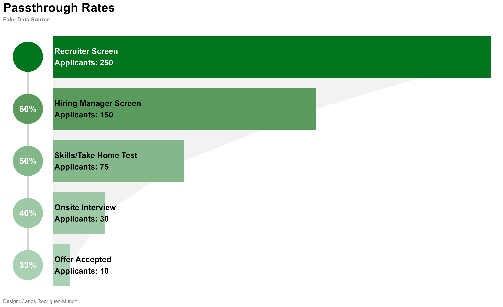

# Passthrough Rate Visualization for Recruiting Pipelines

🎯 **Tired of presenting hiring pipeline data through endless spreadsheets?**

This project is designed to help you create clean, intuitive funnel visualizations using **R**. The goal is to instantly highlight bottlenecks, add polish to your leadership presentations, and help teams optimize the hiring process.

## 🚀 Features

- **Identify Bottlenecks:** Quickly spot stages in your recruiting pipeline where candidates drop off.
- **Leadership-Ready Visuals:** Professional-grade graphics perfect for presentations.
- **Customizable:** Tailor the visualization to include metrics like interview hours per stage, cost per hire, and more.

## 📊 Sample Visualization

The visualization includes:
- A vertical funnel chart showing passthrough rates between stages.
- Bar plots representing the total number of applications at each stage.
- Gradient color-coding to make trends easy to follow at a glance.



## 🛠️ How It Works

The R script uses the following libraries:
- **tidyverse:** Data manipulation and visualization.
- **shadowtext:** Enhanced text for readability.
- **patchwork:** To combine multiple plots.
- **grid:** For additional graphic tweaks.

### Example Stages Visualized:
- Application Review
- Recruiter Screen
- Hiring Manager Screen
- Skills/Take-Home Test
- Onsite Interview
- Offer Accepted

## 📥 Getting Started

1. **Clone the repository:**
   ```bash
   git clone https://github.com/crodriguezm2016/PassthroughRateVisualization.git
   ```
2. **Install required R packages:**
   ```r
   install.packages(c("tidyverse", "shadowtext", "patchwork", "grid"))
   ```
3. **Run the script:**
   ```r
   source("EGPassthroughRateViz.R")
   ```
4. **Customize your data:** Replace the example data with your own recruiting pipeline data.

## 🎨 Customization Tips
- Color Coding:** Adjust gradient colors to highlight specific stages.
- **Additional Metrics:** Add columns to your dataset for metrics like interview hours or cost per stage.
- **Design Tweaks:** Modify themes and fonts for different presentation styles.
   
## 💡 Pro Tips
- **Gradient Effects:** Use color gradients to tell the story of your funnel at a glance.
- **Annotations:** Add custom labels to highlight key insights.
- **Data Insights:** Visualizations can be adapted to reflect not just passthrough rates but also efficiency metrics.

## 📫 Questions?
Reach out if you'd like to geek out about data visualization. I'm always happy to chat about making data more visually appealing! 📊✨
